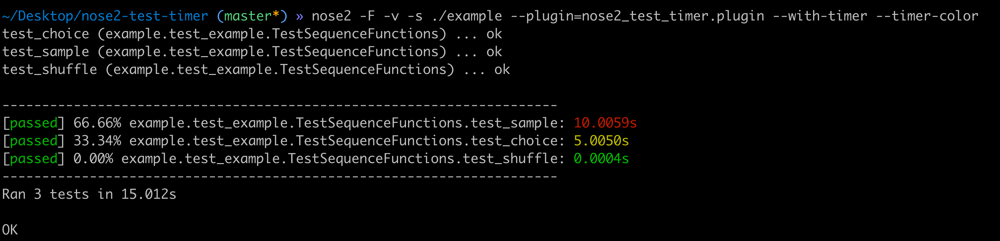

# nose2-test-timer

A timer plugin for nose2 to benchmark time that each unit test take

Ported from nose-timer. Functionality should be mostly but not yet entirely the same

### Install

To install the latest development version from Git::

    pip install git+https://github.com/kaichiachen/nose2-test-timer.git

Or to install the latest from source::

    git clone https://github.com/kaichiachen/nose2-test-timer.git
    cd nose2_test_timer
    pip install .

You can also make a developer install if you plan on modifying the
source frequently::

    pip install -e .


###  Usage
```
nose2 -v -s ./example --plugin=nose2_test_timer.plugin --with-timer --timer-json-file './result.json' --timer-color --timer-top-n 20
```

### License

``nose2-test-timer`` is MIT Licensed library.


